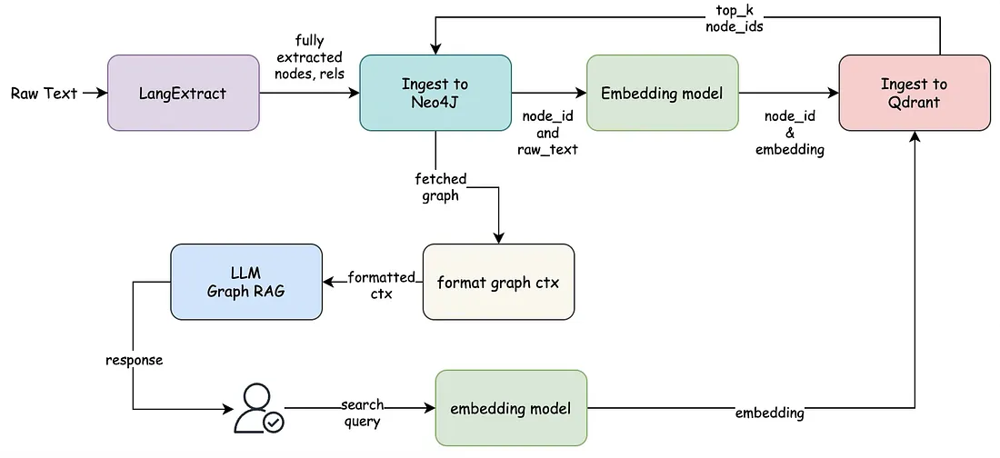

# GraphRAG

A GraphRAG pipeline for querying Persian (Farsi) regulatory and legal banking documents — circulars (بخشنامه), instructions (دستورالعمل), bylaws (آیین‌نامه), and AML-related laws — using a knowledge graph (Neo4j) combined with vector search (Qdrant) and grounded LLM answers.

Given a raw document, the pipeline extracts structured legal entities (document type, reference numbers, dates, issuing authority, articles, notes, defined terms, obligations, deadlines, cross-references), builds a knowledge graph out of them, and answers natural-language questions strictly grounded in that graph.

## How it works

1. **Extraction** — [`langextract`](https://github.com/google/langextract) pulls typed entities out of the raw text using a domain prompt + few-shot examples, grouping every entity under the specific legal instrument it belongs to.
2. **Graph building** — extracted entities are turned into nodes and relationships, anchored around the document itself (preferring `document_type`, falling back to `reference_number`).
3. **Ingestion** — nodes/relationships are written to **Neo4j**; each node is embedded and stored in **Qdrant** for vector search.
4. **Retrieval** — a query is embedded and matched against Qdrant, the matching entities' neighborhood is pulled from Neo4j, and flattened into a text graph context.
5. **Answering** — the graph context is passed to an LLM with strict grounding rules: reason only from the given nodes/edges, preserve legal terminology, and say so explicitly if the graph is missing information.

## Architecture



- **Ingestion side**: raw text → LangExtract → fully extracted nodes/relationships → Neo4j. Node ids and raw text are then embedded and pushed to Qdrant alongside their ids.
- **Query side**: a user's search query is embedded, matched against Qdrant to get `top_k` node ids, that neighborhood is fetched back from Neo4j, formatted into a graph context, and passed to the LLM to produce a grounded response.

## Setup

```bash
pip install -r requirements.txt
```

Create a `.env` file:

```env
QDRANT_URL=...
QDRANT_KEY=...

NEO4J_URI=...
NEO4J_USERNAME=...
NEO4J_PASSWORD=...


OPENAI_API_KEY=...
OPENAI_BASE_URL=...


LLM_MODEL=...
EMBEDDING_MODEL=...
```

## How to use

```python
from src.pipelines.ingestion_pipeline import IngestionPipeline
from src.pipelines.rag_pipeline import RAGPipeline
from src.services.neo4j_service import Neo4jService
from src.utils import load_docx_text

COLLECTION_NAME = "bank_test"
DOCX_PATH = "bank_test.docx"
QUERY = "سامانه سَنا چیست و صرافی‌ها چه وظیفه‌ای در قبال آن دارند؟"


ingestion_pipeline = IngestionPipeline()
rag_pipeline = RAGPipeline()
neo4j_service = Neo4jService()


if __name__ == "__main__":
    try:
        raw_data = load_docx_text(DOCX_PATH)
        ingestion_pipeline.run(raw_data, collection_name=COLLECTION_NAME)

        answer = rag_pipeline.run(QUERY, collection_name=COLLECTION_NAME)
        print("\nFinal Answer:\n", answer)
    finally:
        neo4j_service.close()
```

On the first run against a new document, keep the `ingestion_pipeline.run(...)` call to populate Neo4j and Qdrant; comment it out for subsequent query-only runs against the same collection.